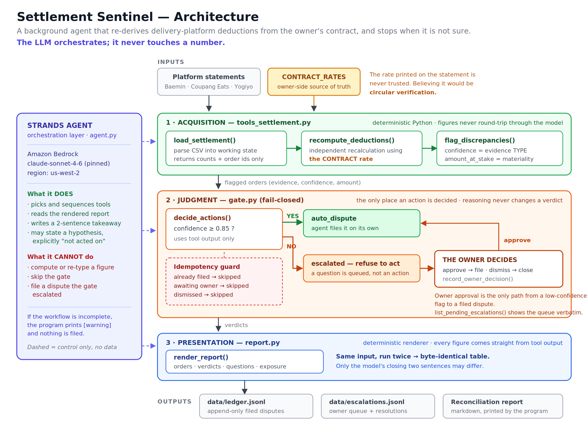
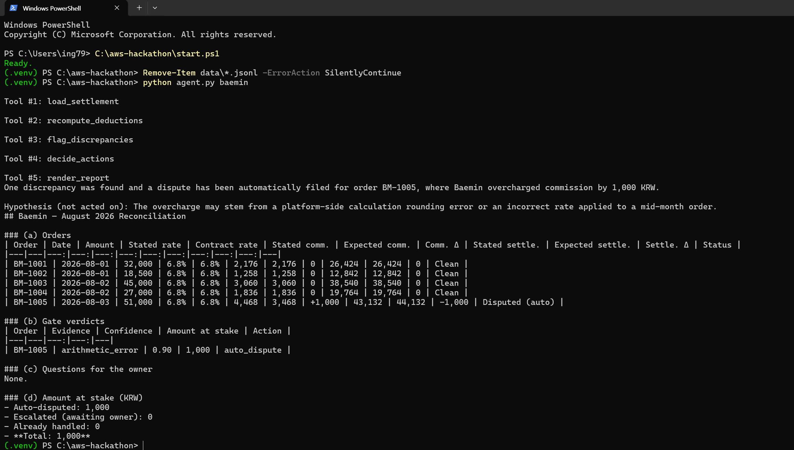
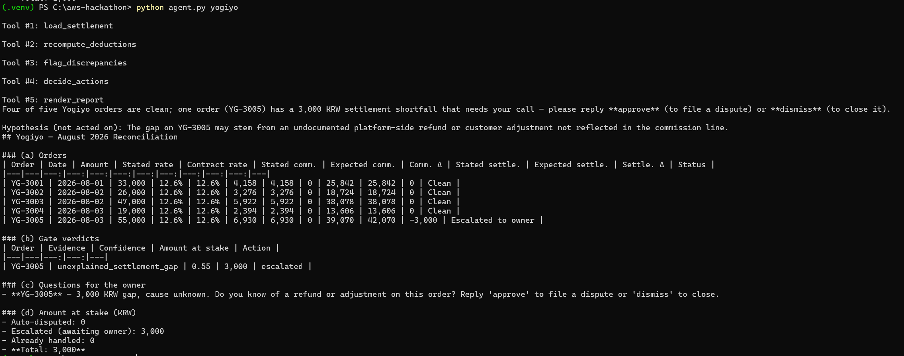
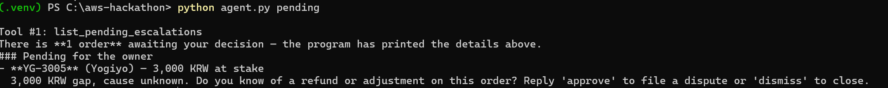

# Settlement Sentinel

A background agent that reconciles delivery-platform settlement statements for a
small restaurant business. It files a dispute when the evidence is certain, and
**refuses to act** when it is not — escalating to the owner with a single question
instead.

Built for the AWS **Agents for Humans** hackathon, Professional Agents track.
Built with the **AWS Strands Agents SDK** on **Amazon Bedrock**.
All code written during the submission period. Synthetic data only.



---

## The problem

One kitchen sells on Baemin, Coupang Eats and Yogiyo. Every month three
settlement statements arrive, each with its own format and its own commission
rate. Checking them line by line takes hours the owner does not have, so a few
hundred won of over-deduction per order is simply never contested.

The obvious fix — "have an LLM read the statement and tell me what's wrong" — is
worse than doing nothing. A model that hallucinates one commission figure, or
files a dispute on a hunch, costs the owner a relationship with the platform.

Settlement Sentinel is built around that constraint: **an agent that is allowed
to be useful only where it can be certain, and is required to stop everywhere
else.**

---

## Design in one line

> Every number is computed, gated, and rendered by deterministic Python.
> The LLM only orchestrates.

The model chooses which tool runs next and writes a two-sentence takeaway at the
end. It does not compute a figure, does not decide an action, and cannot skip
the gate. Those three things live in plain Python, in three files.

---

## Quick start

Requires Python 3.10+ and an Amazon Bedrock API key with access to a Claude model
in `us-west-2`.

**macOS / Linux**
```bash
git clone https://github.com/minjun0208/settlement-sentinel.git
cd settlement-sentinel
python3 -m venv .venv && source .venv/bin/activate
pip install -r requirements.txt
cp .env.example .env          # then edit .env with your key
python agent.py baemin
```

**Windows (PowerShell)**
```powershell
git clone https://github.com/minjun0208/settlement-sentinel.git
cd settlement-sentinel
python -m venv .venv; .\.venv\Scripts\Activate.ps1
pip install -r requirements.txt
Copy-Item .env.example .env   # then edit .env with your key
python agent.py baemin
```

### No AWS access? Run it anyway.

Every command below also accepts `--no-llm`, which runs the same three files in
the same order with **no model in the loop at all** — no credentials, no network:

```bash
python agent.py baemin --no-llm
```

This is not a mock. It is the same pipeline, and it is the honest way to check the
claim above (see [Verifying the claim](#verifying-the-claim)).

---

## Walkthrough

Three statements, three different outcomes. Run them in this order.

### 1. A clean statement with an arithmetic error

```bash
python agent.py baemin
```

The contract rate is 6.8%. On BM-1005 the commission is overstated by exactly the
amount the settlement is understated by — an internally inconsistent line.

```
| Order   | Evidence         | Confidence | Amount at stake | Action       |
|---------|------------------|-----------:|----------------:|--------------|
| BM-1005 | arithmetic_error |       0.90 |           1,000 | auto_dispute |
```

Above threshold. The agent files it and tells the owner afterwards.



### 2. The gate refusing to act

```bash
python agent.py yogiyo
```

YG-3005 is short by 3,000 KRW — **the largest amount in the whole dataset** — but
the commission is correct and nothing on the statement explains the gap. It could
be a platform error. It could equally be a refund the owner already knows about.

```
| Order   | Evidence                   | Confidence | Amount at stake | Action    |
|---------|----------------------------|-----------:|----------------:|-----------|
| YG-3005 | unexplained_settlement_gap |       0.55 |           3,000 | escalated |
```

Below threshold. **The agent does not file it.** It asks:

> **YG-3005** — 3,000 KRW gap, cause unknown. Do you know of a refund or
> adjustment on this order? Reply 'approve' to file a dispute or 'dismiss' to close.



Note the shape of this: confidence and money move in opposite directions. The most
valuable finding is the one the agent is least sure about, and it still stops.
That is the whole point.

### 3. The owner decides

```bash
python agent.py pending
python agent.py approve YG-3005 confirmed double deduction with Yogiyo
```



The dispute is now filed, recorded as `decided_by: owner` rather than `agent`.
Running `python agent.py yogiyo` again returns `skipped_awaiting_owner` /
`skipped_already_filed` rather than filing a second time.

---

## How it works

Three files, run in a fixed order. Each refuses to run unless the previous one has.

| Layer | File | Responsibility |
|---|---|---|
| 1 · Acquire | `tools_settlement.py` | Parse the statement, recompute every fee, flag gaps |
| 2 · Judge | `gate.py` | Decide the action. The only place an action is authorized |
| 3 · Report | `report.py` | Render the report and the owner queue |
| Orchestration | `agent.py` | Strands agent. Sequences tools; writes no figures |

### Never trust the statement's own rate

`recompute_deductions()` recalculates every commission from a contract rate table
held on the owner's side:

```python
CONTRACT_RATES = {"baemin": 0.068, "coupangeats": 0.099, "yogiyo": 0.126}
```

If the recomputation used the rate printed on the statement, CE-2004 — billed at
10.9% against a 9.9% contract — would reconcile to zero and pass as clean. That is
circular verification: checking a document against itself. The contract table is
the independent second source that makes the check mean anything.

### Confidence is a property of the evidence, not of the amount

Confidence is assigned by evidence type in Python, from a fixed table. It is never
produced by the model:

| Evidence | Confidence | Why |
|---|---:|---|
| `rate_mismatch` | 0.95 | The statement contradicts the contract on its face |
| `arithmetic_error` | 0.90 | The statement contradicts itself |
| `unexplained_settlement_gap` | 0.55 | A real gap with no identified cause |

`gate.py` acts alone at or above **0.85** and escalates below it. Amount at stake is
tracked separately and never influences the verdict.

### Fail-closed

The gate refuses by default. A flag reaches the ledger only by clearing the
threshold or by explicit owner approval. If the workflow does not complete, the
program prints a warning and **nothing is filed** — a partial run cannot produce a
partial dispute.

Two append-only files hold all state: `data/ledger.jsonl` (filed disputes) and
`data/escalations.jsonl` (the owner queue and its resolutions).

---

## Verifying the claim

"The LLM only orchestrates" is a claim about the code, so it should be checkable
by running the code. Run the same platform twice, once with the model and once
without:

**macOS / Linux**
```bash
rm -f data/*.jsonl && python agent.py baemin          > with_llm.txt
rm -f data/*.jsonl && python agent.py baemin --no-llm > without_llm.txt
diff with_llm.txt without_llm.txt
```

**Windows (PowerShell)**
```powershell
Remove-Item data\*.jsonl -ErrorAction SilentlyContinue
python agent.py baemin > with_llm.txt
Remove-Item data\*.jsonl -ErrorAction SilentlyContinue
python agent.py baemin --no-llm > without_llm.txt
Compare-Object (Get-Content with_llm.txt) (Get-Content without_llm.txt)
```

Every table row is identical. The only differences are the tool-call trace and the
model's closing sentences. Running the same platform twice with the model also
produces a byte-identical table — nothing in the report is sampled.

If a table row ever differs between these two runs, the claim on this page is
false and should be treated as such.

---

## Known limitations

Stated plainly, because a reviewer will find them anyway.

- **One dominant evidence type per order.** If a rate mismatch and an unrelated
  settlement gap land on the same order, the flag carries the higher confidence and
  `amount_at_stake` is the larger delta, not the sum. Composite evidence is future work.
- **Filing is simulated.** A real deployment would hit each platform's partner API.
  Here `auto_dispute` writes an append-only ledger entry; no request leaves the machine.
- **Synthetic data.** Five orders per platform, hand-built so each of the three
  evidence types appears exactly once. Real statements are messier: partial refunds,
  promotional co-pay, cross-month adjustments.
- **The model may quote a figure in its closing sentences.** It cannot compute or
  gate one, and the rendered report — not the model's prose — is the record.
- **Owner decisions are matched on platform + order id.** Platforms use distinct id
  prefixes here, so ids cannot collide across platforms.
- **The `--no-llm` path is a verification harness, not the product.** The agent is
  the intended entry point; the harness exists so the central claim is falsifiable
  without AWS credentials.

---

## Configuration

`.env.example`:

```
AWS_BEARER_TOKEN_BEDROCK=your-bedrock-api-key-here
AWS_REGION=us-west-2
BEDROCK_MODEL_ID=global.anthropic.claude-sonnet-4-6
```

If your account cannot reach `global.anthropic.claude-sonnet-4-6`, set
`BEDROCK_MODEL_ID` to any Bedrock model you can access — the pipeline does not
depend on the model. Or drop the key entirely and use `--no-llm`.

---

## Built with

Python 3.10 · AWS Strands Agents SDK · Amazon Bedrock (Claude Sonnet 4.6) · boto3 ·
python-dotenv

## License

MIT — see [LICENSE](LICENSE).
